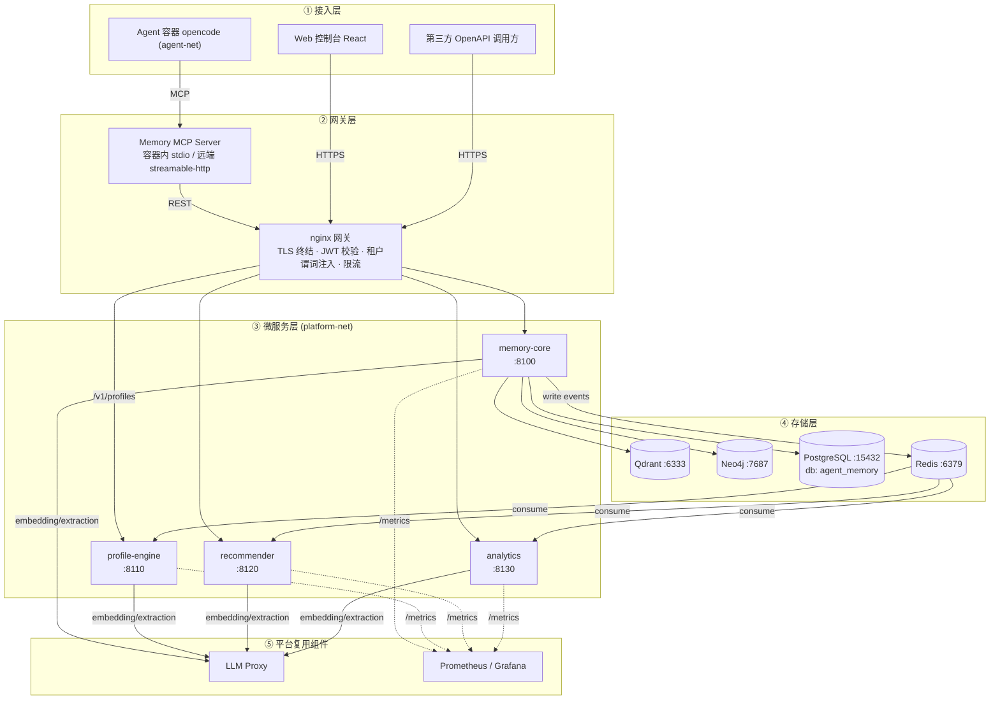
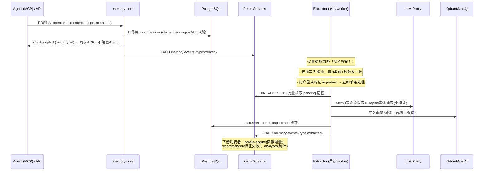

# 02 · 系统架构设计与多租户隔离

---

## 1. 架构分层与部署视图



**服务清单与扩展性**

| 服务 | 无状态 | 水平扩展方式 | 扩容触发信号 |
|------|--------|--------------|--------------|
| memory-core | 是（状态全在存储层） | 多副本 + 网关负载均衡 | p95 检索延迟 > 300ms |
| Memory MCP Server | 是 | 多副本（HTTP 模式）/ 随容器分发（stdio 模式） | 容器连接数 |
| profile-engine | 是 | Consumer Group 增加消费者 | Streams 积压 > 10K |
| recommender | 是 | 多副本 | 推荐延迟 > 500ms |
| analytics | 是（重任务走队列） | 定时任务分片（org 维度） | 夜间批任务超时 |
| Qdrant | — | 集群模式（分片+副本） | 单集合 > 50M 向量 / RAM 80% |
| Neo4j | — | 只读副本（读扩展）；写单主 | 图 > 2 亿边（远期，评估 Fabric） |
| PostgreSQL | — | 读写分离；按 org 分库（远期） | 连接数/IO 瓶颈 |

## 2. 记忆分层模型（借鉴 Letta 的逻辑视图）

| 逻辑层 | 物理实现 | 语义 | 生命周期 |
|--------|----------|------|----------|
| **Core（热记忆）** | PG `memory_core_blocks` + Redis 缓存 | 用户/Agent 当前核心事实（偏好、身份、进行中任务），每轮注入提示词 | 高频更新，容量受控（≤ 4KB/块） |
| **Working（会话记忆）** | Redis + PG `episodes` | 当前会话上下文、滚动摘要 | 会话结束降级 |
| **Archive（归档记忆）** | Qdrant 向量 + Neo4j 图谱 | 全量长期记忆，检索获取 | 永久（带 TTL 策略），软删除 |
| **Graph（事实图谱）** | Neo4j（Graphiti） | 实体-事实边-社区，双时间轴 | 失效不删除（invalid_at） |

## 3. 核心数据流管线

### 3.1 写入管线（成本优化的关键设计）



**设计要点**：
- **同步 ACK + 异步提取**：Agent 写入不等待 LLM（Mem0 每次 add 含提取调用，同步路径会把延迟与成本转嫁给对话流）。
- **批量提取降本**：报告明确指出"每次写入含 LLM 调用，高频写入成本不可忽视"。缓冲策略：`max(50 条, 30s)` 触发批量提取，单批一次 LLM 调用处理多条候选事实，预计节省 60%+ 提取调用。
- **双通道优先级**：`priority=high`（用户显式记忆指令，如"记住我偏好 TypeScript"）走同步快路径。
- **失败重试**：Streams Pending Entries List + XAUTOCLAIM，提取失败进死信队列（PG DLQ 表）+ 告警。

### 3.2 检索管线

```
Query → 网关(注入租户谓词) → memory-core
  → 并行三路召回：
     ① Qdrant 语义向量（scope 过滤，top-20）
     ② BM25/关键词（PG pg_trgm 或 Qdrant 全文，top-20）
     ③ Neo4j 图遍历（实体匹配 → 邻域事实边，含 valid_at 过滤）
  → 融合重排（RRF 起步；Phase 3 可选交叉编码器）
  → 结果统一模型 {memories[], graph_edges[], profile_hints}
  → Redis 缓存（key=hash(query+谓词), TTL 60s）
```

### 3.3 画像更新管线（事件驱动 + 睡眠计算）

- **增量（在线）**：消费 `memory.events`，按事件类型轻量更新计数器与兴趣标签分布（Redis/PG），p99 < 50ms。
- **重组（离线，每日低峰 + 用户空闲期触发）**：借鉴 Letta sleep-time compute——批量执行：记忆去重合并、Core 块重写（LLM 摘要）、兴趣向量重算（衰减加权 embedding 均值）、能力图谱重评（GDS 度中心性）、画像快照落 PG。详细算法见 03 文档 §2。

### 3.4 推荐管线

召回（Qdrant 画像向量 KNN + Neo4j 图近邻 + 运营规则）→ 打分（`α·sim + β·graph_proximity + γ·importance + δ·recency`）→ MMR 多样性重排 → 附证据链返回。详细设计见 03 文档 §3。

## 4. 松耦合与契约治理

1. **通信**：同步 = REST（OpenAPI 3.1 契约，CI 校验向后兼容）；异步 = Redis Streams 消息 schema 版本化（`schema_ver` 字段，消费者向后兼容 N-1）。
2. **存储归属**：Qdrant/Neo4j 写路径仅 memory-core 可达；profile-engine 只写画像表；analytics 只读。防止越界写入导致数据不一致。
3. **引擎适配器**：`MemoryEngine` / `GraphEngine` 接口隔离 Mem0/Graphiti API，provider 可替换（如向量库切 Milvus、图库切 FalkorDB 时只改适配器）。
4. **独立演进**：四服务各自独立仓库/目录、独立 CI、独立镜像版本；控制台消费 OpenAPI 生成 TS client，契约先行。

## 5. 多租户隔离设计（安全核心）

### 5.1 身份与租户模型

```
Org（组织/云端租户）
 └─ Team（团队）           ← team_memories 共享域
     └─ User（用户）        ← 个人记忆域（platform 用户体系，JWT subject）
         └─ Agent（容器）   ← agent_id = 容器实例标识（run_id = 会话）
Scope: personal | team | org   （记忆可见性三级）
Role:  owner | admin | editor | viewer   （团队内角色）
```

JWT claims（由平台 backend 签发，网关强制校验）：

```json
{
  "sub": "u_123", "org_id": "o_1",
  "teams": ["t_a:admin", "t_b:editor"],
  "mcp_token": true, "scopes": ["mem:read", "mem:write", "profile:read"]
}
```

### 5.2 各存储层的隔离机制

| 存储 | 隔离机制 | 强制点 |
|------|----------|--------|
| Qdrant | 单 collection + payload 过滤（`org_id` / `scope` / `owner_id` / `team_ids[]`），org_id 与 scope 字段建 payload index；超大租户（>10M 向量）独立 collection | memory-core 检索入口**代码级强制**拼接谓词，禁止裸查询；单元测试覆盖越权注入 |
| Neo4j (Graphiti) | group_id = `{org}:{scope_owner}`（如 `o1:u123`、`o1:ta`），每条查询带 group 谓词；跨组聚合仅在 analytics 服务内白名单执行 | GraphAdapter 统一注入，业务代码无法触达裸 driver |
| PostgreSQL | 多租户行 + 应用层过滤；**RLS 兜底**（`current_setting('app.org_id')` 策略），防 SQL 注入/代码缺陷导致跨租户读取 | 连接池 per-request SET LOCAL |
| Redis | key 前缀 = `org_id:`；Streams 单流（事件体含租户），消费端按租户路由 | 中间件统一 key 规范 |

### 5.3 访问控制矩阵（团队记忆核心）

| 操作 | personal(scope=owner) | team scope | org scope |
|------|----------|------------|-----------|
| 读 | 本人 | team 成员（viewer+） | 全 org 成员 |
| 写/更新 | 本人 | editor+ | editor+ |
| 删除 | 本人 | admin+（软删 + 审计） | admin+ |
| 授权管理 | — | owner/admin | org admin |

- **删除语义**：借鉴 Graphiti"失效不删除"——删除 = `deleted_at` 软删 + 图谱边 `invalid_at` 标记 + 30 天后物理清除（可配置保留期，满足审计）。
- **MCP 令牌**：Agent 容器使用独立短令牌（per-container，由 backend 注入容器环境变量），claims 仅含 `mem:read/write` + 绑定 user_id，**不能**访问画像管理与团队管理 API；泄漏影响面受限，可单独吊销。

### 5.4 纵深防御清单

| 层 | 措施 |
|----|------|
| 传输 | 全链路 TLS 1.3（网关终结）；集群内部 mTLS（Phase 3，service mesh 可选） |
| 认证 | JWT（15min）+ refresh；MCP 容器令牌独立签发/吊销 |
| 授权 | RBAC + scope 三级 + 网关谓词注入 + 服务内二次校验（不信任网关） |
| 输入 | OpenAPI schema 强校验；prompt 注入防护：LLM 提取输入做角色分离与指令过滤 |
| 审计 | 全部写操作与越权尝试记 `audit_log`（who/when/what/before/after），100% 采样，WORM 保留 1 年 |
| 限流 | 平台 rate_limit 复用：org/user/agent 三维 token bucket；提取队列按 org 配额隔离（防嘈杂邻居） |
| 数据 | 静态加密：PG/卷级 LUKS 或云盘加密；敏感字段（content）应用层 AES-256-GCM 可选（合规租户）；embedding 不可逆但按敏感数据处理 |

## 6. 可靠性设计

- **故障域隔离**：一 Agent 容器故障不影响服务；存储单点各有副本策略（05 文档）。
- **降级路径**：Neo4j 不可用 → 检索自动降级为纯向量+BM25（图信号缺失，功能降级非不可用）；Redis 不可用 → 绕过缓存直查 + 提取缓冲落 PG 队列表。
- **幂等性**：写入携带 client 幂等键（`Idempotency-Key`），重试安全；事件处理以 memory_id+version 去重。
- **背压**：提取队列满（>10K）时写入返回 429 + Retry-After，保护 LLM Proxy 与存储。
