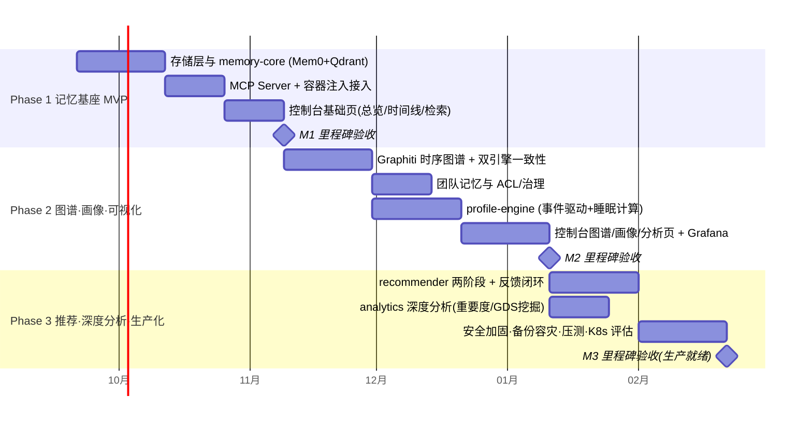

# 06 · 分阶段实施计划与关键里程碑

> 原则：**每个阶段结束都交付可运行、可演示、可评测的垂直切片**（tracer-bullet 式），不搞长周期大爆炸集成。

---

## 1. 阶段总览

---

## 2. Phase 1 · 记忆基座 MVP（目标：Agent 能"记住并想起"）

**范围**：Qdrant + PostgreSQL + Redis 部署；memory-core（Mem0 写入/检索/CRUD/软删 + 批量提取管线 + SSE）；Memory MCP Server（stdio + 5 个核心工具：search/add/get/update/delete）并接入 builtin-mcp 注入机制；控制台基础三页；LLM Proxy 对接。

| 里程碑 | 时间点 | 验收标准（可量化） |
|--------|--------|--------------------|
| **M1** | 第 7 周末 | ① 平台任一用户容器内，Agent 对话中说"记住 X"，10 分钟后新会话可检索召回；② 检索 p95 < 500ms（1 万向量）；③ 批量导入 1 万条历史对话，提取成功率 > 99%；④ 跨租户越权用例 100% 拦截；⑤ 控制台可见写入/检索统计 |

**关键风险**：Mem0 提取效果依赖模型与提示词 → M1 前用平台真实对话抽样 500 组跑自建召回评测集（报告 06 节结论），达标线 Top-5 命中率 ≥ 70%，不达标先调提示词/换抽取模型再进入 Phase 2。

## 3. Phase 2 · 图谱、团队与画像（目标：可视化观测 + 事实可信）

**范围**：Neo4j + Graphiti 引擎接入（episode 摄入、双时间轴、失效不删除）；双引擎一致性管线（03 §1）；团队记忆（team scope + RBAC + 共享审批 + 配额）；profile-engine v1（兴趣/能力/行为 + 睡眠计算批任务）；控制台图谱探索（G6）、画像中心、团队治理页；Grafana 运维看板。

| 里程碑 | 时间点 | 验收标准 |
|--------|--------|----------|
| **M2** | 第 15 周末 | ① "三个月前的事实"时点查询正确（自建时序测试集 ≥ 90%）；② 团队记忆：成员 A 写入、成员 B（editor）可检索，viewer 不可写，越权 0 逃逸；③ 画像：连续使用 1 周后兴趣标签 Top5 与人工标注一致率 ≥ 60%，画像快照每日版本化；④ 图谱页 10K 节点交互流畅（首屏 < 2s）；⑤ 删除→软删→30 天清除链路审计可查 |

## 4. Phase 3 · 推荐与生产化（目标：个性化 + 云端服务就绪）

**范围**：recommender（R1/R2 场景 + 反馈闭环 + 可解释输出）；analytics 深度分析（重要度多因子模型、GDS 关联挖掘、使用模式报告）；安全纵深加固（mTLS/内容加密选项/越权 fuzz）；备份容灾落地与恢复演练；压测（2K 并发检索）；K8s 迁移评估（按需）；（可选）LightFM 排序实验、Superset 评估。

| 里程碑 | 时间点 | 验收标准 |
|--------|--------|----------|
| **M3** | 第 22 周末 | ① 推荐采纳率（在线反馈）≥ 15%，每条推荐含证据链；② 重要度 Top100 记忆与专家标注重合度 ≥ 70%；③ 压测达 SLO（05 §2.1）；④ 全量恢复演练通过（RPO/RTO 达 05 §4.1 表）；⑤ 审计/加密/限流合规清单全绿 |

## 5. 风险登记与缓解

| 风险 | 等级 | 缓解 |
|------|------|------|
| 厂商 benchmark 不可信，效果不达预期 | 高 | 以自有评测集为准入闸（M1/M2 各设达标线）；引擎适配器保留更换余地 |
| LLM 提取成本超预算 | 中 | 批量管线 + 小模型 + org 配额限流；token 日账单告警 |
| Graphiti 实体消解错误（同名合并/否定误判） | 中 | 冲突队列人工/LLM 仲裁；本体约束（Pydantic 类型）收紧；抽样质检 |
| 双引擎数据不一致 | 中 | extraction_id 关联 + 睡眠计算一致性校验任务 + 对账报表 |
| Neo4j 社区版无热备 | 中 | 事实边表同步 PG（05 §4.1）；季度演练 |
| 团队记忆隐私顾虑（个人事实流入团队域） | 中 | 默认 personal，team 写入显式声明 + 审批模式可选；导出/删除权保障 |
| opencode/MCP 生态变更 | 低 | MCP Server 与平台注入机制解耦，stdio/HTTP 双模式兜底 |

## 6. 团队与工程节奏建议

- **最小团队**：2 后端（memory-core/管线 + 画像/推荐）、1 前端（控制台）、1 兼职 SRE（部署/监控/容灾）。
- **节奏**：双周迭代，每迭代结尾跑评测集与冒烟（延续平台 verify.sh 风格）；契约（OpenAPI/事件 schema）变更需评审。
- **演进后路**（M3 后 backlog）：Kafka 替换 Streams、Milvus 超大规模档、跨区域容灾、OpenAPI 开放给第三方生态、记忆市场（org 间合规共享）。

---

## 附：交付物与需求映射核对

| 需求 | 交付位置 |
|------|----------|
| 1. 微服务架构/松耦合/多租户 | README §2、02 §1-§5 |
| 2. 记忆管理/可视化/分析/画像/推荐 | 02 §3、03 §2-§5、04 |
| 3. 开源选型评估与定制范围 | 01 全文 |
| 4. API/MCP/批量/流式/示例 | 04 全文 |
| 5. 高并发缓存/加密权限/备份容灾 | 05 §2-§4、02 §5 |
| 6. 架构图/选型报告/定制设计/数据模型/API/部署运维/分期计划 | 全套 7 份文档 |
