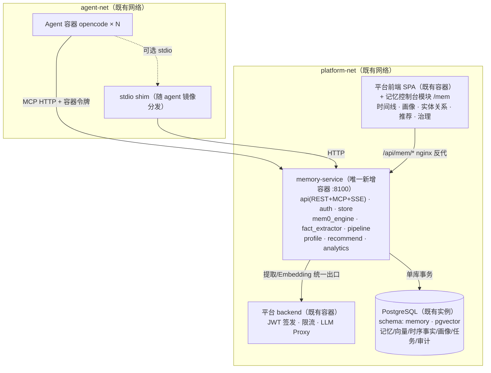

# 云端 Agent 记忆服务（Agent Memory Cloud）· 完整解决方案

> 基于 [agent-memory-top3-report](../agent-memory-top3-report.html) 调研结论设计的可视化云端 Agent 记忆服务方案。
> 目标平台：**agent-docker-platform**（多用户 Agent 容器平台），兼容独立部署。
>
> **当前版本：v2.1（模块化单体架构）** —— v1 的微服务多存储方案经复杂度评估后重构（v2，见
> [07-optimized-solution.md](07-optimized-solution.md)）；v2.1 增补问题推荐 S1/S2 接口、画像三触发调度、
> 短期记忆摄取机制、可视化接入路径与 Mem0 差异对比（07 §11）。01–06 号文档为 v1 深度设计参考
> （算法、API 契约、安全清单仍然有效），架构形态与组件清单以 07 为准。

---

## 0. 一句话方案（v2）

在平台既有的 PostgreSQL（+pgvector）之上，新增**唯一一个服务 memory-service**（FastAPI 模块化单体，
内嵌 Mem0 提取引擎 + MCP 端点），控制台以模块并入既有 React SPA，通过 MCP + REST 双通道接入
每用户的 opencode Agent 容器，实现**个人/团队记忆的云端存储、可视化观测、深度分析、动态画像与个性化推荐**。

## 1. 核心设计决策速览（TL;DR）

| # | 决策 | 结论 | 依据 |
|---|------|------|------|
| D1 | 服务形态 | **1 个 FastAPI 模块化单体**（API+MCP+管线+画像+推荐+分析为进程内模块） | 同域同团队、≤50 并发用户，微服务属过早分布式；模块边界+双进程角色（web/--worker）保留演进空间 |
| D2 | 记忆引擎 | **Mem0 OSS 嵌入式库**（Apache-2.0，65.2K★），pgvector provider | user/agent/run 命名空间天然多租户；提取/更新决策引擎省数月自研；provider 抽象保留向量库可换性 |
| D3 | 时序/图谱 | **PG 双时间戳事实表**（entity_facts）+ networkx 离线批算 | 双时间轴语义（valid_at/invalid_at）SQL 原生表达；1–2 跳关联=JOIN；Neo4j+Graphiti 移入条件触发的升级路径（07 §9） |
| D4 | Letta 用法 | 借鉴不引入 | Core/Recall/Archival 三层 → 精简为 Core+Archive 两层（Working 归还 opencode 会话管理）；睡眠计算思想落地为画像夜批 |
| D5 | 向量存储 | **pgvector**（复用既有 PG 实例） | ≤100 万向量在 HNSW 舒适区；省一个引擎一套备份；超 500 万触发换 Qdrant（Mem0 provider 切换） |
| D6 | 可视化 | **控制台模块并入平台 React SPA** + AntV G6 + ECharts | 记忆时间线/画像/实体关系是业务语义视图，Grafana/Superset 无法承载；并入 SPA 复用认证/构建/部署 |
| D7 | 推荐系统 | **问题推荐 S1/S2**（会话开场/下一轮建议提问，生成式）+ **R1/R2**（记忆回顾/知识关联，检索式），全带证据链；LightFM 远期可选 | TensorRec 停维护；问题推荐走"grounding→LLM 生成→进程内排序→预取缓存"，检索式冷启动靠内容召回+画像加权 |
| D8 | 队列/事件 | **PG 任务表**（SKIP LOCKED + LISTEN/NOTIFY） | 日均数百事件用不上 Redis Streams/Kafka；任务表即持久层即 DLQ，全链路一张表可观测 |
| D9 | Agent 接入 | **双通道**：MCP over HTTP（显式记忆与上下文消费）+ **镜像内摄取 plugin**（短期记忆自动摄取旁路，07 §11.3） | MCP 面向需 agent 判断的操作；自动摄取需确定性通道（零 token、不依赖 LLM 决策），故走 plugin 事件钩子而非 MCP |
| D10 | 备份 | **单套 pg_dump + WAL 归档** | 单库承载全部数据，恢复=恢复一个数据库（RPO ≤ 5min / RTO 30min） |
| D11 | 画像刷新 | **三触发异步调度**（实时钩子/每日夜批/空闲插队），APScheduler + PG advisory lock | 活跃用户画像新鲜度 ≤ 6h；复用任务表防重，零新组件（07 §11.2） |

## 2. 系统总体架构（v2）

**模块关系**（详见 [07-optimized-solution.md](07-optimized-solution.md) §4）：

| 模块（进程内） | 职责 | 对外契约 |
|----------------|------|----------|
| api | REST `/v1/*` + MCP 工具面 + SSE 订阅 | 唯一对外出口（OpenAPI 3.1） |
| pipeline | 写入管线 worker（同步 ACK + 批量异步提取） | 消费 PG 任务表 |
| profile | 画像：事件钩子增量 + 夜批重组（兴趣/能力/行为） | REST `/v1/profiles/*` |
| recommend | 两阶段推荐（R1 记忆回顾 / R2 知识关联），可解释输出 | REST `/v1/recommendations/*` |
| analytics | 用法统计、重要度多因子评分、networkx 关联挖掘 | REST `/v1/analytics/*` |

**松耦合保留方式**：模块间仅经 `api`/`store` 两个契约面交互；`web` 与 `--worker` 双进程角色可独立扩副本；引擎经 provider 适配层（向量库/图路径均可替换）。

## 3. 与现有平台（agent-docker-platform）的集成点

| 集成点 | 复用方式 |
|--------|----------|
| 网络拓扑 | memory-service 双挂 `platform-net`（前端/PG/LLM Proxy）与 `agent-net`（Agent 容器 MCP 直连） |
| MCP 注入机制 | 仿 `agent-image/builtin-mcp/web_search/manifest.json` 新增 `memory` manifest；stdio shim 打进 agent 镜像 |
| LLM Proxy | 提取与 Embedding 全部走 backend `/llm-proxy`，统一计费/限流/密钥 |
| 认证与限流 | 复用平台 JWT 与 rate_limit；控制台为 SPA 新路由 `/mem` |
| PostgreSQL | 既有实例新增独立 database `agent_memory`，便于独立备份与权限收口 |
| 前端 | 并入 `frontend/src`（新模块目录），复用构建与 nginx 反代 |

## 4. 交付物索引

| 文档 | 状态 | 内容 |
|------|------|------|
| [07-optimized-solution.md](07-optimized-solution.md) | **当前生效** | v2 全量方案：v1 复杂度评估、规模重估、裁剪决策、模块化单体架构、组件必要性矩阵、精简流程、数据模型 delta、11 周计划、升级触发条件表、复杂度对比；**§11（v2.1 增补）：S1/S2 问题推荐接口、画像三触发调度、短期记忆摄取机制（plugin 旁路 + MCP）、可视化接入路径、与直接用 Mem0 的差异对比** |
| [01-tech-selection.md](01-tech-selection.md) | v1 参考 | 记忆基座/向量库/图引擎/可视化/推荐框架逐项评估（选型论证仍有效，部署结论以 07 为准） |
| [02-architecture.md](02-architecture.md) | v1 参考 | 数据流管线、多租户隔离与安全模型（管线语义保留，事件总线/降级路径按 07 收敛） |
| [03-custom-modules.md](03-custom-modules.md) | v1 参考 | 画像算法、推荐打分公式、重要度多因子模型、控制台页面清单、MCP 工具面（算法不变，形态为进程内模块） |
| [04-data-model-api.md](04-data-model-api.md) | v1 参考 | REST/MCP API 契约与接入示例（**继续有效**）；DDL 以 07 §6 delta 为准 |
| [05-deployment-ops.md](05-deployment-ops.md) | v1 参考 | SLO/缓存/安全清单（指标沿用）；部署/备份以 07 §7 为准 |
| [06-roadmap.md](06-roadmap.md) | v1 参考 | 22 周版路线图与风险登记（计划以 07 §8 的 11 周版为准） |

## 5. 范围与非目标

**范围内**：个人记忆、团队记忆（scope+RBAC）、可视化观测（并入平台前端，/mem 模块）、深度分析（重要度/关联挖掘）、动态画像（三触发异步刷新）、问题推荐 S1/S2（会话开场/下一轮建议提问）、检索式推荐 R1/R2、短期记忆摄取与注入（plugin 旁路 + MCP）、多租户治理、完整审计。

**非目标/延后项（v2 明确）：
- 不替换/内嵌 Agent 运行时（opencode 仍是容器内唯一 runtime）
- R3（技能成长）/R4（决策辅助）推荐场景、审批制团队记忆、mTLS、Superset、Grafana → backlog，默认不建设
- Qdrant/Neo4j/Redis/Kafka/K8s → 仅在 [07 §9 触发条件](07-optimized-solution.md)满足后引入
- 不承诺厂商自报 Benchmark 分数，验收以平台自有对话集的召回评测为准
